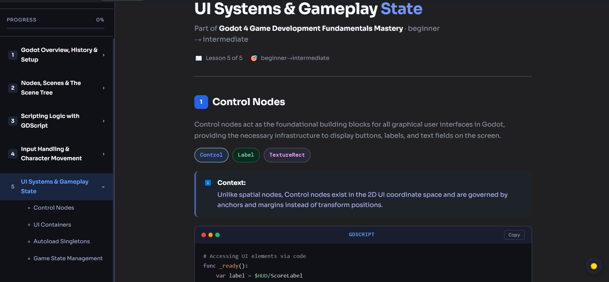
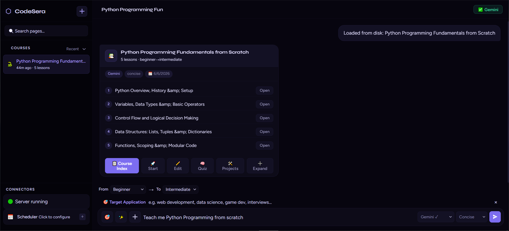

# ⬡ CodeSera

> AI-powered interactive highly token efficient course builder. Describe what you want to learn — CodeSera generates a complete multi-lesson course with exercises, quizzes, an in-lesson AI assistant, and working navigation — all running locally.

  

---

## What it does

Type a prompt like *"Teach me Python from beginner to intermediate"* and CodeSera runs a three-agent pipeline:

1. **Planner** — decides course structure, lesson count, topics, doc references
2. **Research Agent** — gathers dense technical notes per lesson (skipped for well-known topics to save tokens)
3. **Writer Agent** — generates complete styled HTML lessons with exercises and code examples

It does'nt generate HTML, CSS or other components from scratch making it highly token efficient. Output is a real multi-page course saved to disk, served at `localhost:3000`, fully navigable in your browser.

---

---




---

## Features

### Course Generation
- 🤖 **Multi-agent pipeline** — Planner → Researcher → Writer, fully automatic
- 📚 **4–8 lessons per course** — scope-aware, progressive difficulty
- ⚡ **Smart token savings** — skips research for Python, JS, React, SQL and 40+ well-known topics
- ➕ **Expand courses** — add lessons to any existing course with one click
- 🎯 **Target application** — tailor examples to your use case (web dev, data science, game dev…)
- ✨ **Customization checklist** — Newbie mode, Teach like I'm 13, Heavy on code, Project-focused, Learning objectives, Misconception busters, Difficulty ramp, Real-world analogies
- 💡 **Lesson DNA** — consistent tone, pacing and code density across all lessons

### Lesson Pages
- 🎨 **Dual theme** — toggled per-page with `☀️`
- 🧩 **Interactive exercises** — MCQ, code fill-in, true/false with scoring
- 📊 **Progress bar** — tracks completed exercises, persists across visits
- 💬 **In-lesson AI chat** — ask questions about the lesson
- 🤖 **Tell me more** — AI-generated expandable sections on demand(cached locally)
- 📋 **Syntax highlighting** — Prism.js with autoloader for 200+ languages

### App UI
- 🔑 **Multi-provider API** — OpenRouter, ChatGPT, Gemini, DeepSeek, custom etc
- 🧠 **AI Quiz mode** — generates fresh quizzes, tracks best scores
- 🛠️ **Projects feature** — AI-generated guided build projects per course
- 📅 **Study scheduler** — browser notifications via Service Worker, fires even when tab is closed
- 🔍 **Course search + sort** — filter by name, sort by recent/added/A–Z
- 🌐 **Server-backed** — courses saved to `courses/` folder, all links work natively at `localhost:3000`

---

## Getting started

### Requirements

- [Node.js](https://nodejs.org/) v18 or higher
- A modern browser (Chrome, Edge, Firefox)
- An API key from any supported provider

### Setup

```bash
git clone https://github.com/RylanHexx/CodeSera.git
cd CodeSera
npm run build
node server.js
```

No `npm install` needed — server uses only Node built-ins. Opens at `http://localhost:3000`.

### First use

1. Click **🔑 API Keys** in the top bar
2. Select a provider — **Gemini 3.1 Flash Lite** is recommended for their generous free api usage, (free tier available at [aistudio](https://aistudio.google.com/app/apikey))
3. Type a learning prompt, e.g. *"Teach me Python"* or *"C++ for competitive programming"*
4. Optionally click **✨** to enable customization options or **🎯** to set a target application
5. Select level range and teaching style, then hit **Send**
6. Click **📋 Course Index** or **🚀 Start** to open your course

---

## Build

`src/assets.js` is auto-generated from files in `lesson/`. Regenerate after editing any of: `lesson/lesson.css`, `lesson/lesson-light.css`, `lesson/lesson.js`, `lesson/lesson-chat.js`:

```bash
npm run build
```

---

## Project structure

```
codesera/
├── server.js              # Node.js server — static + /save + /proxy (no deps)
├── sw-scheduler.js        # Service worker for background notifications
├── package.json
│
├── public/                # App shell served to browser
│   ├── index.html         # Main app UI
│   └── styles.css         # App UI styles
│
├── src/                   # App logic
│   ├── app.js             # State, sidebar, course management, wiring
│   ├── api.js             # API client, provider configs, callApi()
│   ├── agents.js          # Multi-agent pipeline: Planner, Researcher, Writer
│   ├── renderer.js        # Assembles full lesson HTML from AI fragments
│   ├── quiz.js            # Quiz generation, runner, scoring
│   ├── projects.js        # Project ideas + guided lesson builder
│   └── assets.js          # Auto-generated — run npm run build
│
├── lesson/                # Files embedded in every lesson page
│   ├── lesson.css         # Lesson design system (dark theme)
│   ├── lesson-light.css   # Warm parchment light theme
│   ├── lesson.js          # Exercises, sidebar, progress, copy buttons
│   └── lesson-chat.js     # In-lesson AI chat, selection reply, Tell me more
│
├── scripts/
│   └── build-assets.js    # Regenerates src/assets.js from lesson/ files
│
└── courses/               # Generated course files (auto-created, gitignored)
    └── CourseName/
        ├── index.html
        ├── nav.html
        ├── lesson-1.html … lesson-N.html
        └── projects/
            └── project-slug.html
```

---

## Contributing

### Design system (`lesson/`)

Edit files in `lesson/` to change how lesson pages look or behave. Run `npm run build` after any change to regenerate `src/assets.js`.

### AI prompts (`agents.js`)

| Constant | Purpose |
|---|---|
| `PLANNER_PROMPT` | Course structure JSON |
| `RESEARCH_PROMPT` | Dense lesson notes |
| `WRITER_SYSTEM_PROMPT` | Full lesson generation guide + HTML component templates |

### Adding a provider (`api.js`)

Add to the `PROVIDERS` object and to `<select id="apiProviderSel">` in `index.html`:

```js
myprovider: {
  label:   'My Provider',
  url:     'https://api.myprovider.com/v1/chat/completions',
  model:   () => 'model-name',
  headers: key => ({ 'Authorization': `Bearer ${key}`, 'Content-Type': 'application/json' }),
  hint:    'Get your key at myprovider.com',
  showModelInput: false,
},
```

---

## Roadmap

- [ ] Per-lesson regeneration without rebuilding the whole course
- [ ] Anki cards file generation feature
- [ ] Generate courses from CLI(for AI agents)

---

## License

MIT
